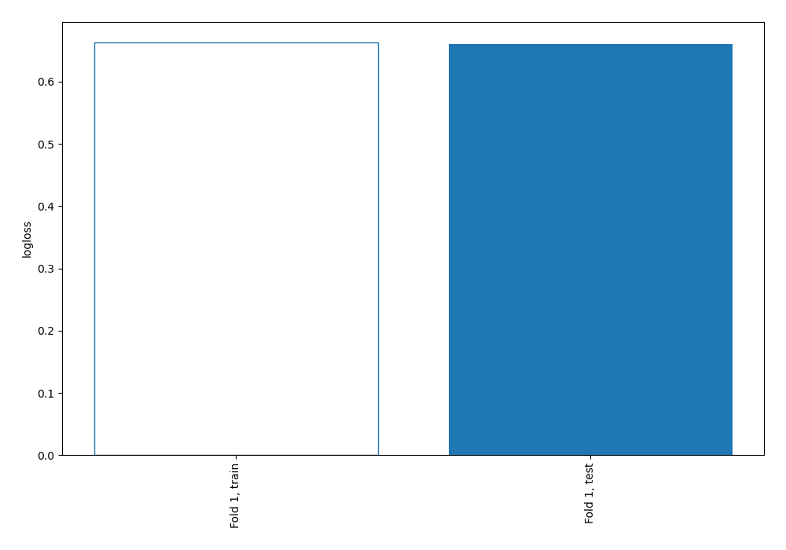

# Summary of 1_Baseline

[<< Go back](../README.md)

## Baseline Classifier (Baseline)
- **n_jobs**: -1
- **explain_level**: 2

## Validation
 - **validation_type**: split
 - **train_ratio**: 0.75
 - **shuffle**: True
 - **stratify**: True

## Optimized metric
logloss

## Training time

0.9 seconds

## Metric details
|           |    score |   threshold |
|:----------|---------:|------------:|
| logloss   | 0.660643 |   nan       |
| auc       | 0.5      |   nan       |
| f1        | 0.543478 |     0.33975 |
| accuracy  | 0.373134 |     0.33975 |
| precision | 0.373134 |     0.33975 |
| recall    | 1        |     0.33975 |
| mcc       | 0        |     0.33975 |

## Confusion matrix (at threshold=0.33975)
|                     |   Predicted as negative |   Predicted as positive |
|:--------------------|------------------------:|------------------------:|
| Labeled as negative |                       0 |                      84 |
| Labeled as positive |                       0 |                      50 |

## Learning curves

[<< Go back](../README.md)
