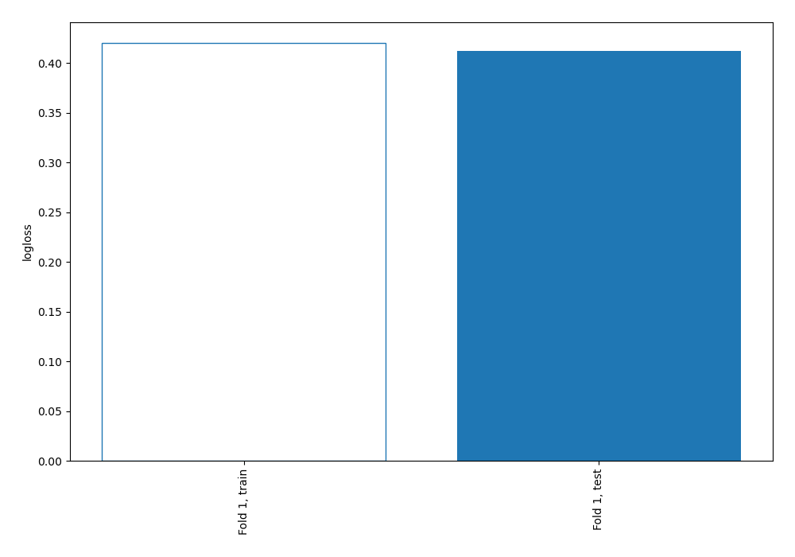
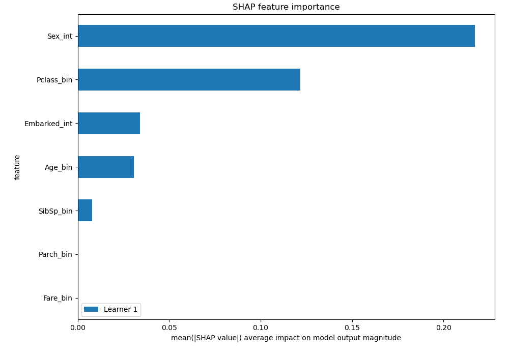
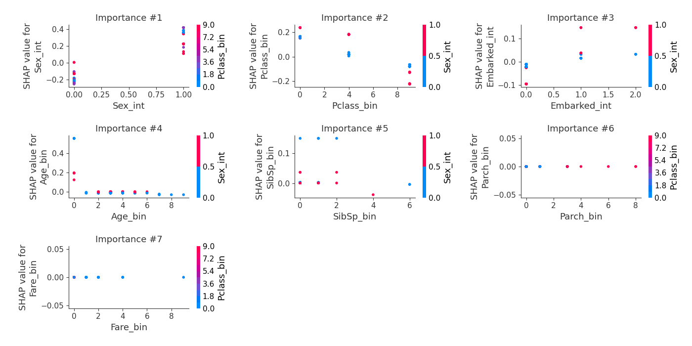

# Summary of 2_DecisionTree

[<< Go back](../README.md)

## Decision Tree
- **n_jobs**: -1
- **criterion**: gini
- **max_depth**: 3
- **explain_level**: 2

## Validation
 - **validation_type**: split
 - **train_ratio**: 0.75
 - **shuffle**: True
 - **stratify**: True

## Optimized metric
logloss

## Training time

33.5 seconds

## Metric details
|           |    score |   threshold |
|:----------|---------:|------------:|
| logloss   | 0.412559 |  nan        |
| auc       | 0.874286 |  nan        |
| f1        | 0.760331 |    0.228881 |
| accuracy  | 0.820896 |    0.54818  |
| precision | 1        |    0.957746 |
| recall    | 1        |    0.124752 |
| mcc       | 0.617414 |    0.54818  |

## Confusion matrix (at threshold=0.54818)
|                     |   Predicted as negative |   Predicted as positive |
|:--------------------|------------------------:|------------------------:|
| Labeled as negative |                      81 |                       3 |
| Labeled as positive |                      21 |                      29 |

## Learning curves

## SHAP Importance

## SHAP Dependence plots

### Dependence (Fold 1)

## SHAP Decision plots

[<< Go back](../README.md)
