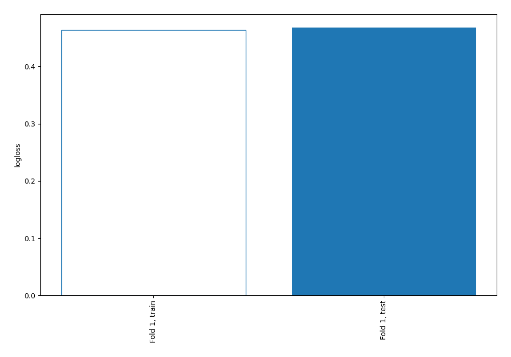
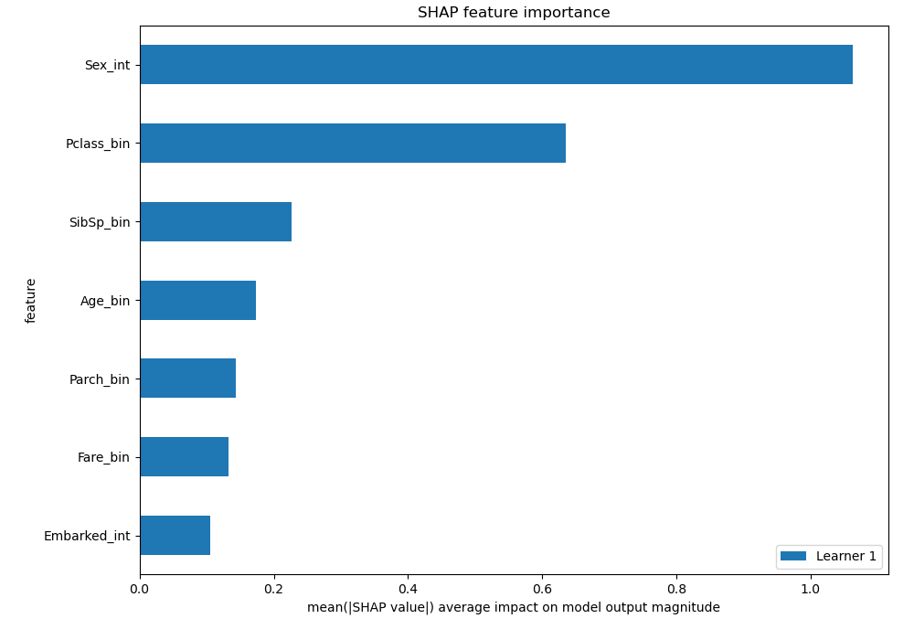
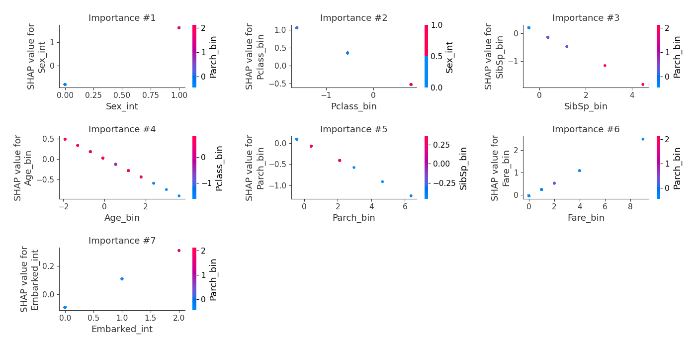

# Summary of 3_Linear

[<< Go back](../README.md)

## Logistic Regression (Linear)
- **n_jobs**: -1
- **explain_level**: 2

## Validation
 - **validation_type**: split
 - **train_ratio**: 0.75
 - **shuffle**: True
 - **stratify**: True

## Optimized metric
logloss

## Training time

22.4 seconds

## Metric details
|           |    score |   threshold |
|:----------|---------:|------------:|
| logloss   | 0.467948 | nan         |
| auc       | 0.830714 | nan         |
| f1        | 0.733945 |   0.322099  |
| accuracy  | 0.80597  |   0.490807  |
| precision | 1        |   0.913984  |
| recall    | 1        |   0.0143342 |
| mcc       | 0.577701 |   0.490807  |

## Confusion matrix (at threshold=0.490807)
|                     |   Predicted as negative |   Predicted as positive |
|:--------------------|------------------------:|------------------------:|
| Labeled as negative |                      74 |                      10 |
| Labeled as positive |                      16 |                      34 |

## Learning curves

## Coefficients
| feature      |   Learner_1 |
|:-------------|------------:|
| Sex_int      |    2.40682  |
| Fare_bin     |    0.2828   |
| Embarked_int |    0.20174  |
| Parch_bin    |   -0.1958   |
| Age_bin      |   -0.250775 |
| SibSp_bin    |   -0.411838 |
| Pclass_bin   |   -0.662558 |
| intercept    |   -1.67173  |

## SHAP Importance

## SHAP Dependence plots

### Dependence (Fold 1)

## SHAP Decision plots

[<< Go back](../README.md)
