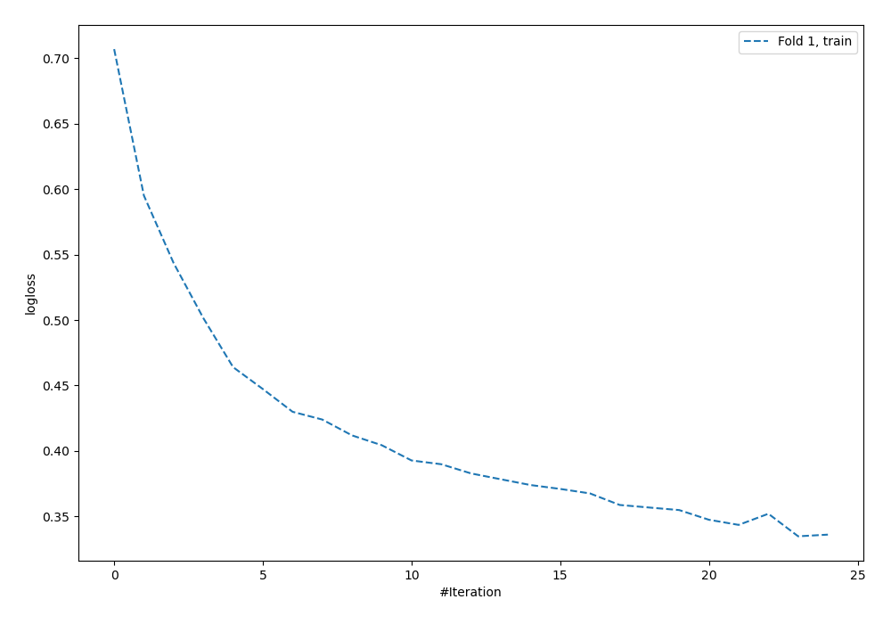

# Summary of 5_Default_NeuralNetwork

[<< Go back](../README.md)

## Neural Network
- **n_jobs**: -1
- **dense_1_size**: 32
- **dense_2_size**: 16
- **learning_rate**: 0.05
- **explain_level**: 2

## Validation
 - **validation_type**: split
 - **train_ratio**: 0.75
 - **shuffle**: True
 - **stratify**: True

## Optimized metric
logloss

## Training time

16.4 seconds

## Metric details
|           |    score |    threshold |
|:----------|---------:|-------------:|
| logloss   | 0.436969 | nan          |
| auc       | 0.862857 | nan          |
| f1        | 0.773109 |   0.210732   |
| accuracy  | 0.820896 |   0.546447   |
| precision | 1        |   0.984838   |
| recall    | 1        |   0.00196869 |
| mcc       | 0.625322 |   0.210732   |

## Confusion matrix (at threshold=0.546447)
|                     |   Predicted as negative |   Predicted as positive |
|:--------------------|------------------------:|------------------------:|
| Labeled as negative |                      81 |                       3 |
| Labeled as positive |                      21 |                      29 |

## Learning curves

[<< Go back](../README.md)
