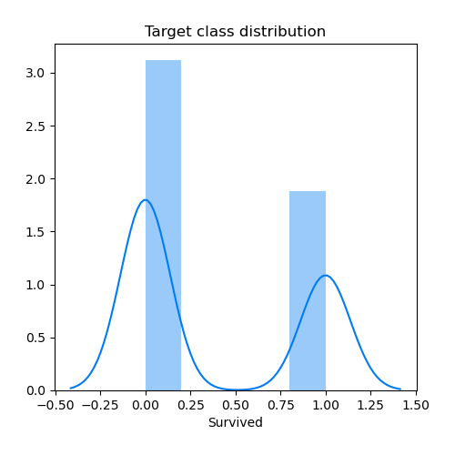
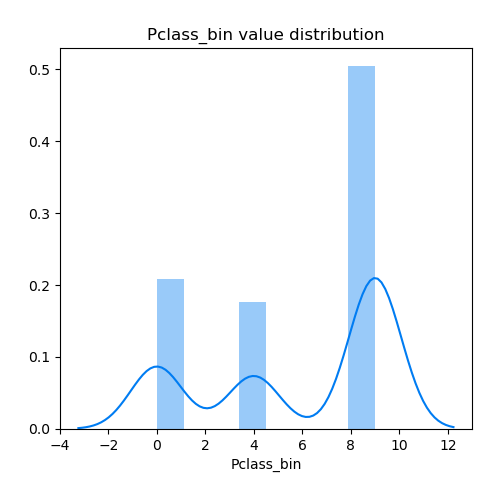
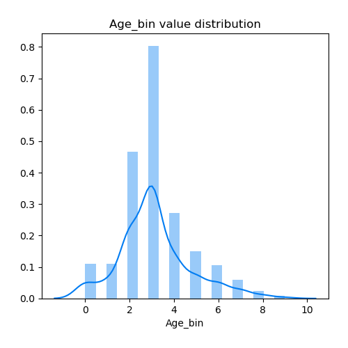
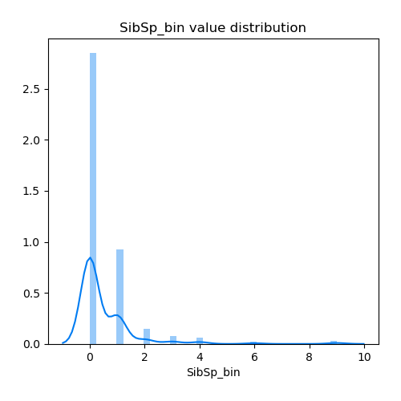
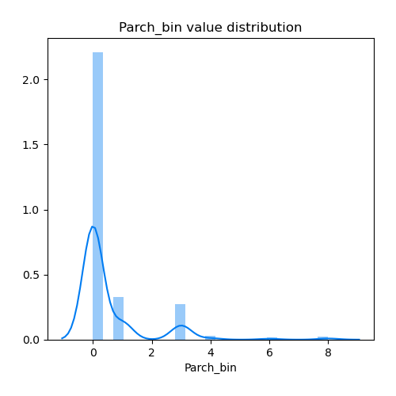
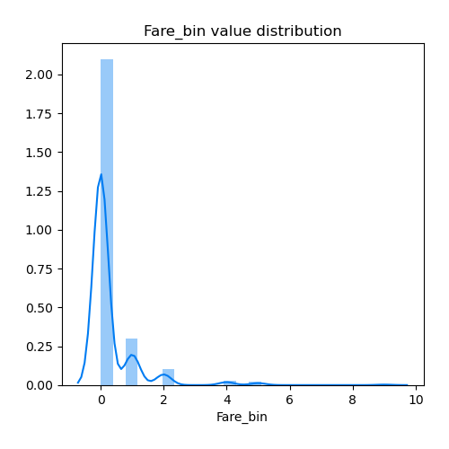
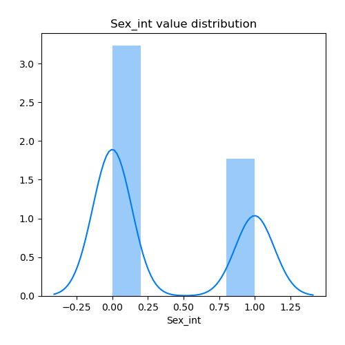
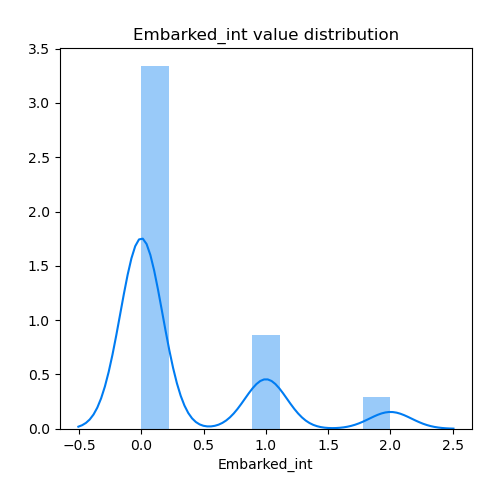

# Exploratory Data Analysis

[<< Go back](../README.md)
## Feature : target
- **Feature type** : continous
- **Missing** : 0.0%
- **Unique** : 2
- **Count** :534.0
- **Mean** :0.37640449438202245
- **Std** :0.4849376599250003
- **Min** :0.0
- **25%th Percentile** : 0.0
- **50%th Percentile** : 0.0
- **75%th Percentile** : 1.0
- **Max** :1.0

## Feature : Pclass_bin
- **Feature type** : discrete
- **Missing** : 0.0%
- **Unique** : 3
- **Count** :534.0
- **Mean** :5.900749063670412
- **Std** :3.7874433847679816
- **Min** :0.0
- **25%th Percentile** : 4.0
- **50%th Percentile** : 9.0
- **75%th Percentile** : 9.0
- **Max** :9.0

## Feature : Age_bin
- **Feature type** : discrete
- **Missing** : 0.0%
- **Unique** : 10
- **Count** :534.0
- **Mean** :3.1310861423220975
- **Std** :1.620010869046912
- **Min** :0.0
- **25%th Percentile** : 2.0
- **50%th Percentile** : 3.0
- **75%th Percentile** : 4.0
- **Max** :9.0

## Feature : SibSp_bin
- **Feature type** : discrete
- **Missing** : 0.0%
- **Unique** : 7
- **Count** :534.0
- **Mean** :0.5131086142322098
- **Std** :1.1504206259880092
- **Min** :0.0
- **25%th Percentile** : 0.0
- **50%th Percentile** : 0.0
- **75%th Percentile** : 1.0
- **Max** :9.0

## Feature : Parch_bin
- **Feature type** : discrete
- **Missing** : 0.0%
- **Unique** : 6
- **Count** :534.0
- **Mean** :0.5318352059925093
- **Std** :1.2350105403216882
- **Min** :0.0
- **25%th Percentile** : 0.0
- **50%th Percentile** : 0.0
- **75%th Percentile** : 0.0
- **Max** :8.0

## Feature : Fare_bin
- **Feature type** : discrete
- **Missing** : 0.0%
- **Unique** : 6
- **Count** :534.0
- **Mean** :0.299625468164794
- **Std** :0.8444276291154694
- **Min** :0.0
- **25%th Percentile** : 0.0
- **50%th Percentile** : 0.0
- **75%th Percentile** : 0.0
- **Max** :9.0

## Feature : Sex_int
- **Feature type** : discrete
- **Missing** : 0.0%
- **Unique** : 2
- **Count** :534.0
- **Mean** :0.3539325842696629
- **Std** :0.4786369435979602
- **Min** :0.0
- **25%th Percentile** : 0.0
- **50%th Percentile** : 0.0
- **75%th Percentile** : 1.0
- **Max** :1.0

## Feature : Embarked_int
- **Feature type** : discrete
- **Missing** : 0.0%
- **Unique** : 3
- **Count** :534.0
- **Mean** :0.32397003745318353
- **Std** :0.5922469433245715
- **Min** :0.0
- **25%th Percentile** : 0.0
- **50%th Percentile** : 0.0
- **75%th Percentile** : 1.0
- **Max** :2.0

[<< Go back](../README.md)
