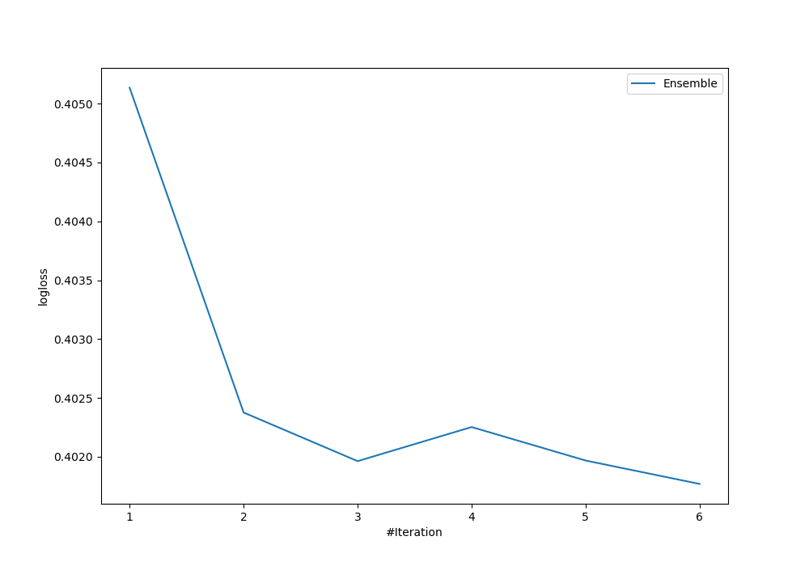

# Summary of Ensemble

[<< Go back](../README.md)

## Ensemble structure
| Model             |   Weight |
|:------------------|---------:|
| 2_DecisionTree    |        2 |
| 3_Linear          |        1 |
| 4_Default_Xgboost |        3 |

## Metric details
|           |    score |   threshold |
|:----------|---------:|------------:|
| logloss   | 0.401769 | nan         |
| auc       | 0.895    | nan         |
| f1        | 0.803571 |   0.281388  |
| accuracy  | 0.835821 |   0.414045  |
| precision | 1        |   0.947442  |
| recall    | 1        |   0.0833217 |
| mcc       | 0.676676 |   0.281388  |

## Confusion matrix (at threshold=0.414045)
|                     |   Predicted as negative |   Predicted as positive |
|:--------------------|------------------------:|------------------------:|
| Labeled as negative |                      77 |                       7 |
| Labeled as positive |                      15 |                      35 |

## Learning curves

[<< Go back](../README.md)
