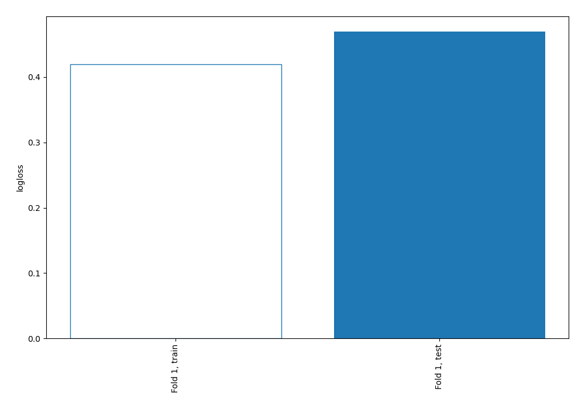
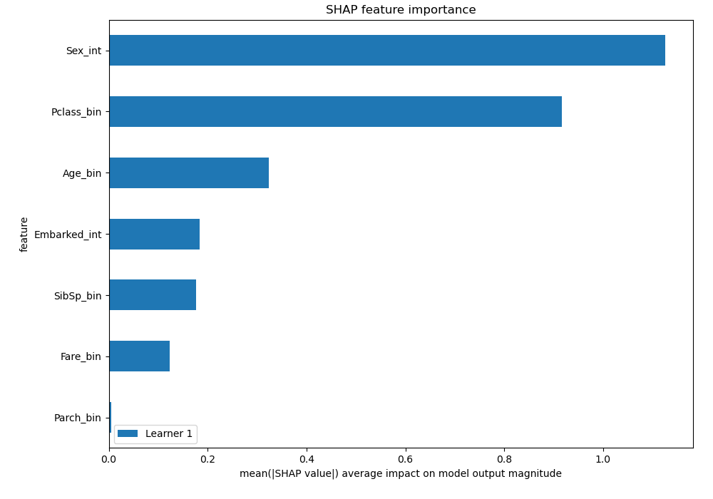
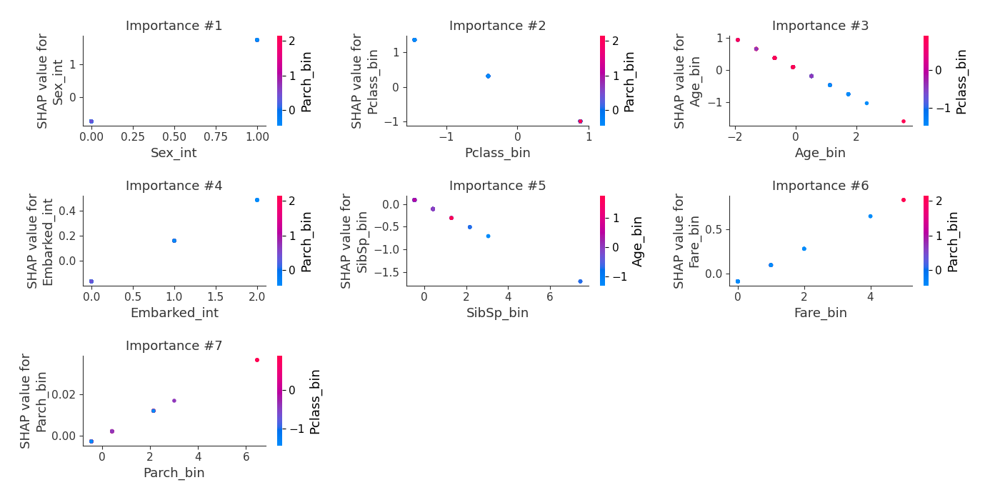

# Summary of 3_Linear

[<< Go back](../README.md)

## Logistic Regression (Linear)
- **n_jobs**: -1
- **explain_level**: 2

## Validation
 - **validation_type**: split
 - **train_ratio**: 0.75
 - **shuffle**: True
 - **stratify**: True

## Optimized metric
logloss

## Training time

22.7 seconds

## Metric details
|           |    score |   threshold |
|:----------|---------:|------------:|
| logloss   | 0.469528 |  nan        |
| auc       | 0.832984 |  nan        |
| f1        | 0.737705 |    0.295848 |
| accuracy  | 0.798507 |    0.584002 |
| precision | 1        |    0.915535 |
| recall    | 1        |    0.015733 |
| mcc       | 0.574622 |    0.584002 |

## Confusion matrix (at threshold=0.584002)
|                     |   Predicted as negative |   Predicted as positive |
|:--------------------|------------------------:|------------------------:|
| Labeled as negative |                      75 |                       6 |
| Labeled as positive |                      21 |                      32 |

## Learning curves

## Coefficients
| feature      |   Learner_1 |
|:-------------|------------:|
| Sex_int      |  2.52366    |
| Embarked_int |  0.323615   |
| Fare_bin     |  0.185848   |
| Parch_bin    |  0.00563829 |
| SibSp_bin    | -0.227451   |
| Age_bin      | -0.463357   |
| Pclass_bin   | -1.00869    |
| intercept    | -1.58866    |

## SHAP Importance

## SHAP Dependence plots

### Dependence (Fold 1)

## SHAP Decision plots

[<< Go back](../README.md)
