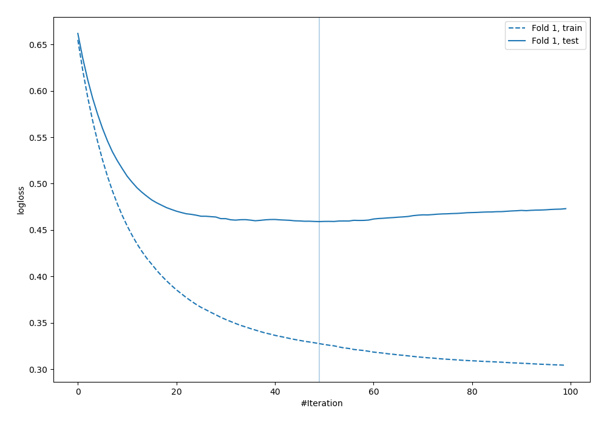
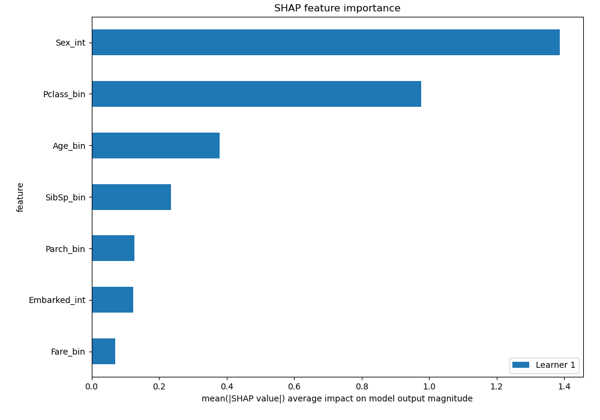
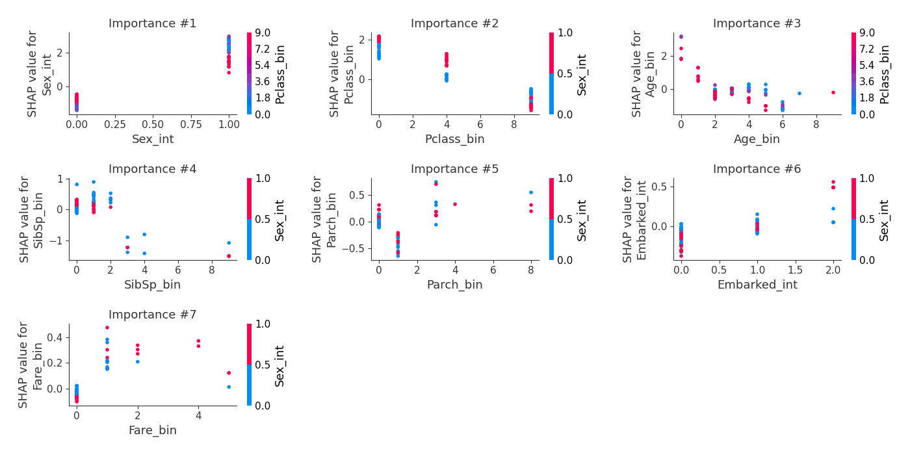

# Summary of 4_Default_Xgboost

[<< Go back](../README.md)

## Extreme Gradient Boosting (Xgboost)
- **n_jobs**: -1
- **objective**: binary:logistic
- **eval_metric**: logloss
- **eta**: 0.075
- **max_depth**: 6
- **min_child_weight**: 1
- **subsample**: 1.0
- **colsample_bytree**: 1.0
- **explain_level**: 2

## Validation
 - **validation_type**: split
 - **train_ratio**: 0.75
 - **shuffle**: True
 - **stratify**: True

## Optimized metric
logloss

## Training time

20.8 seconds

## Metric details
|           |    score |   threshold |
|:----------|---------:|------------:|
| logloss   | 0.459093 | nan         |
| auc       | 0.828675 | nan         |
| f1        | 0.733333 |   0.521215  |
| accuracy  | 0.820896 |   0.521215  |
| precision | 0.962963 |   0.875242  |
| recall    | 1        |   0.0397444 |
| mcc       | 0.626967 |   0.521215  |

## Confusion matrix (at threshold=0.521215)
|                     |   Predicted as negative |   Predicted as positive |
|:--------------------|------------------------:|------------------------:|
| Labeled as negative |                      77 |                       4 |
| Labeled as positive |                      20 |                      33 |

## Learning curves

## SHAP Importance

## SHAP Dependence plots

### Dependence (Fold 1)

## SHAP Decision plots

[<< Go back](../README.md)
