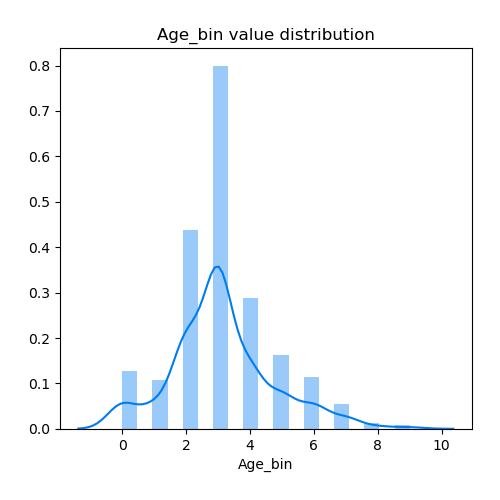

# Exploratory Data Analysis

[<< Go back](../README.md)
## Feature : target
- **Feature type** : continous
- **Missing** : 0.0%
- **Unique** : 2
- **Count** :534.0
- **Mean** :0.398876404494382
- **Std** :0.4901263876567762
- **Min** :0.0
- **25%th Percentile** : 0.0
- **50%th Percentile** : 0.0
- **75%th Percentile** : 1.0
- **Max** :1.0

## Feature : Pclass_bin
- **Feature type** : discrete
- **Missing** : 0.0%
- **Unique** : 3
- **Count** :534.0
- **Mean** :5.621722846441948
- **Std** :3.8307504726658754
- **Min** :0.0
- **25%th Percentile** : 0.0
- **50%th Percentile** : 9.0
- **75%th Percentile** : 9.0
- **Max** :9.0

## Feature : Age_bin
- **Feature type** : discrete
- **Missing** : 0.0%
- **Unique** : 10
- **Count** :534.0
- **Mean** :3.1198501872659175
- **Std** :1.602255438931427
- **Min** :0.0
- **25%th Percentile** : 2.0
- **50%th Percentile** : 3.0
- **75%th Percentile** : 4.0
- **Max** :9.0

## Feature : SibSp_bin
- **Feature type** : discrete
- **Missing** : 0.0%
- **Unique** : 7
- **Count** :534.0
- **Mean** :0.5730337078651685
- **Std** :1.298470514166554
- **Min** :0.0
- **25%th Percentile** : 0.0
- **50%th Percentile** : 0.0
- **75%th Percentile** : 1.0
- **Max** :9.0

## Feature : Parch_bin
- **Feature type** : discrete
- **Missing** : 0.0%
- **Unique** : 6
- **Count** :534.0
- **Mean** :0.5374531835205992
- **Std** :1.2409151560978622
- **Min** :0.0
- **25%th Percentile** : 0.0
- **50%th Percentile** : 0.0
- **75%th Percentile** : 0.0
- **Max** :8.0

## Feature : Fare_bin
- **Feature type** : discrete
- **Missing** : 0.0%
- **Unique** : 7
- **Count** :534.0
- **Mean** :0.32209737827715357
- **Std** :0.9456122141463812
- **Min** :0.0
- **25%th Percentile** : 0.0
- **50%th Percentile** : 0.0
- **75%th Percentile** : 0.0
- **Max** :9.0

## Feature : Sex_int
- **Feature type** : discrete
- **Missing** : 0.0%
- **Unique** : 2
- **Count** :534.0
- **Mean** :0.3539325842696629
- **Std** :0.4786369435979602
- **Min** :0.0
- **25%th Percentile** : 0.0
- **50%th Percentile** : 0.0
- **75%th Percentile** : 1.0
- **Max** :1.0

## Feature : Embarked_int
- **Feature type** : discrete
- **Missing** : 0.0%
- **Unique** : 3
- **Count** :534.0
- **Mean** :0.3595505617977528
- **Std** :0.6321087910361027
- **Min** :0.0
- **25%th Percentile** : 0.0
- **50%th Percentile** : 0.0
- **75%th Percentile** : 1.0
- **Max** :2.0

[<< Go back](../README.md)
