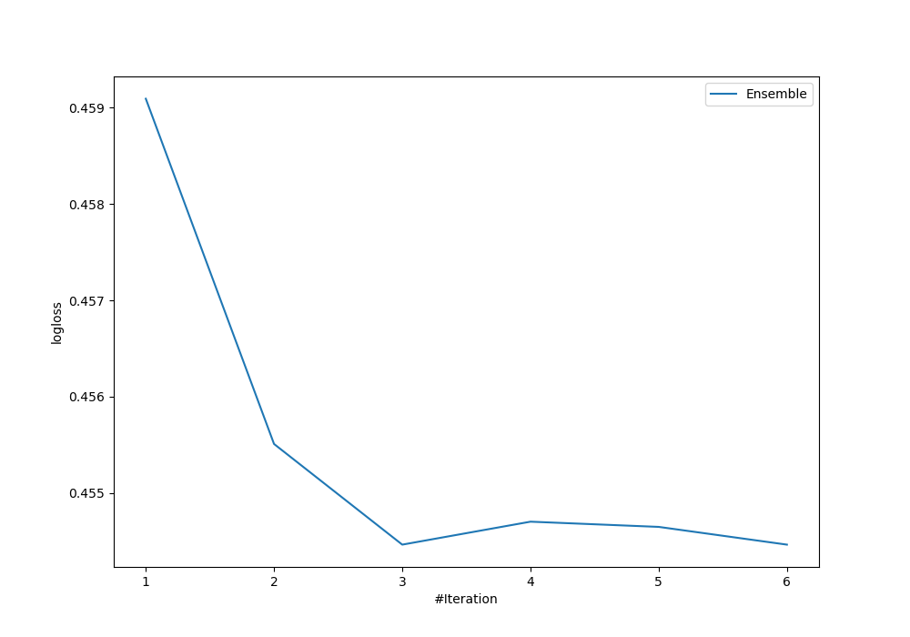

# Summary of Ensemble

[<< Go back](../README.md)

## Ensemble structure
| Model             |   Weight |
|:------------------|---------:|
| 3_Linear          |        1 |
| 4_Default_Xgboost |        2 |

## Metric details
|           |    score |   threshold |
|:----------|---------:|------------:|
| logloss   | 0.454465 | nan         |
| auc       | 0.839273 | nan         |
| f1        | 0.759259 |   0.428095  |
| accuracy  | 0.820896 |   0.516226  |
| precision | 1        |   0.928259  |
| recall    | 1        |   0.0421048 |
| mcc       | 0.626967 |   0.530381  |

## Confusion matrix (at threshold=0.516226)
|                     |   Predicted as negative |   Predicted as positive |
|:--------------------|------------------------:|------------------------:|
| Labeled as negative |                      76 |                       5 |
| Labeled as positive |                      19 |                      34 |

## Learning curves

[<< Go back](../README.md)
