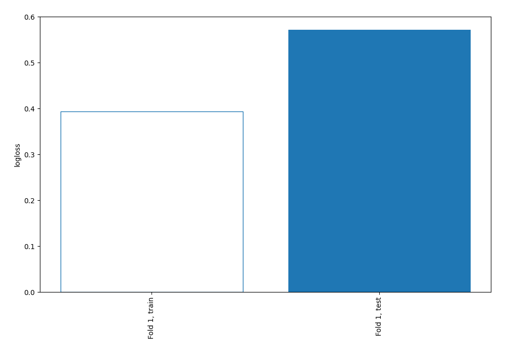
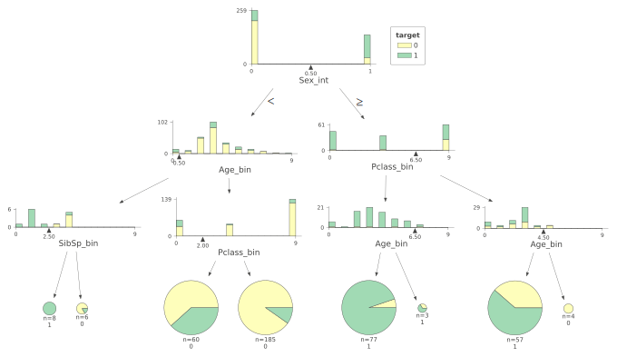
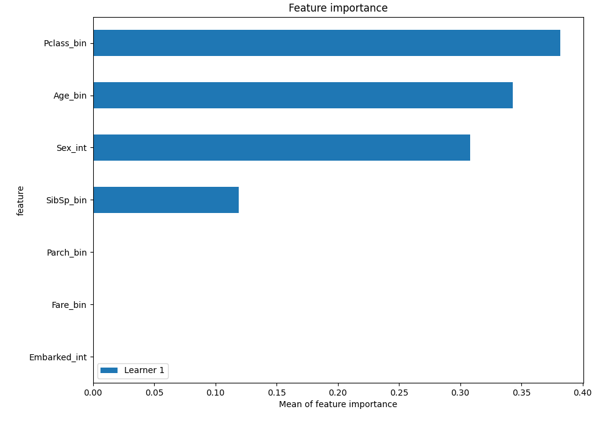
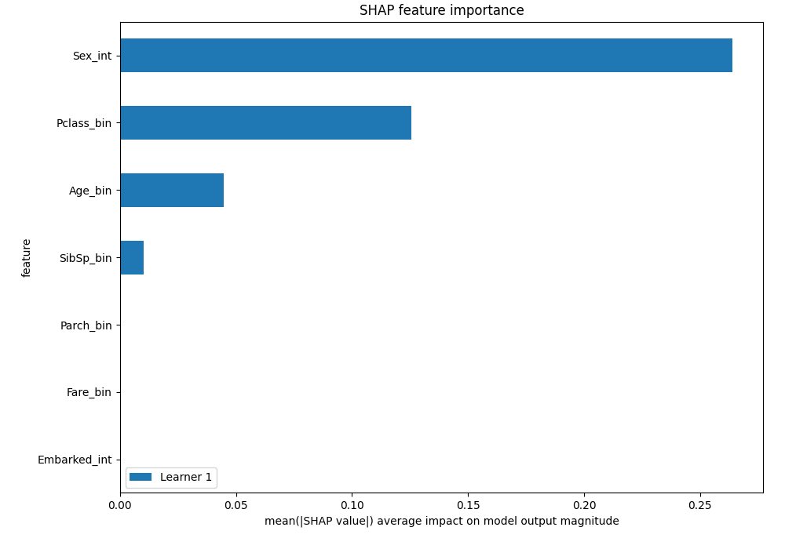
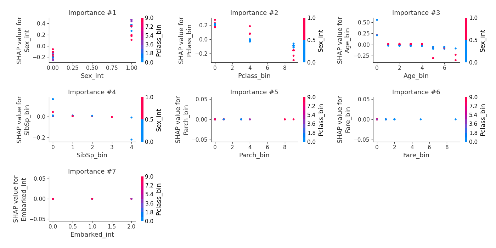

# Summary of 2_DecisionTree

[<< Go back](../README.md)

## Decision Tree
- **n_jobs**: -1
- **criterion**: gini
- **max_depth**: 3
- **explain_level**: 2

## Validation
 - **validation_type**: split
 - **train_ratio**: 0.75
 - **shuffle**: True
 - **stratify**: True

## Optimized metric
logloss

## Training time

128.9 seconds

## Metric details
|           |    score |   threshold |
|:----------|---------:|------------:|
| logloss   | 0.571513 |  nan        |
| auc       | 0.816204 |  nan        |
| f1        | 0.722222 |    0.522675 |
| accuracy  | 0.791045 |    0.665693 |
| precision | 1        |    0.948052 |
| recall    | 0.981481 |    0        |
| mcc       | 0.580722 |    0.665693 |

## Confusion matrix (at threshold=0.665693)
|                     |   Predicted as negative |   Predicted as positive |
|:--------------------|------------------------:|------------------------:|
| Labeled as negative |                      78 |                       2 |
| Labeled as positive |                      26 |                      28 |

## Learning curves

## Decision Tree 

### Tree #1

### Rules

if (Sex_int <= 0.5) and (Age_bin > 0.5) and (Pclass_bin > 2.0) then class: 0 (proba: 90.27%) | based on 185 samples

if (Sex_int > 0.5) and (Pclass_bin <= 6.5) and (Age_bin <= 6.5) then class: 1 (proba: 94.81%) | based on 77 samples

if (Sex_int <= 0.5) and (Age_bin > 0.5) and (Pclass_bin <= 2.0) then class: 0 (proba: 61.67%) | based on 60 samples

if (Sex_int > 0.5) and (Pclass_bin > 6.5) and (Age_bin <= 4.5) then class: 1 (proba: 61.4%) | based on 57 samples

if (Sex_int <= 0.5) and (Age_bin <= 0.5) and (SibSp_bin <= 2.5) then class: 1 (proba: 100.0%) | based on 8 samples

if (Sex_int <= 0.5) and (Age_bin <= 0.5) and (SibSp_bin > 2.5) then class: 0 (proba: 83.33%) | based on 6 samples

if (Sex_int > 0.5) and (Pclass_bin > 6.5) and (Age_bin > 4.5) then class: 0 (proba: 100.0%) | based on 4 samples

if (Sex_int > 0.5) and (Pclass_bin <= 6.5) and (Age_bin > 6.5) then class: 1 (proba: 66.67%) | based on 3 samples

## Permutation-based Importance

## SHAP Importance

## SHAP Dependence plots

### Dependence (Fold 1)

## SHAP Decision plots

[<< Go back](../README.md)
