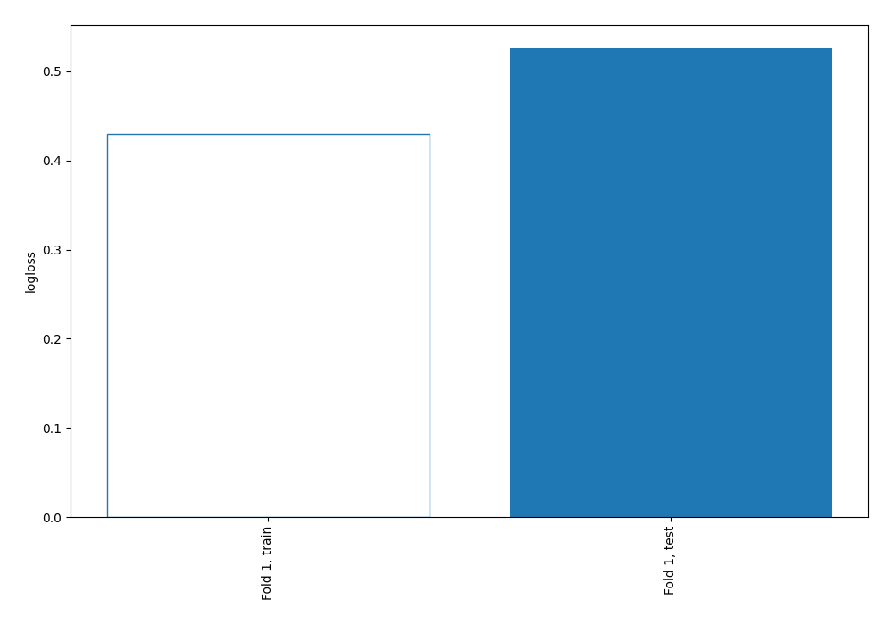
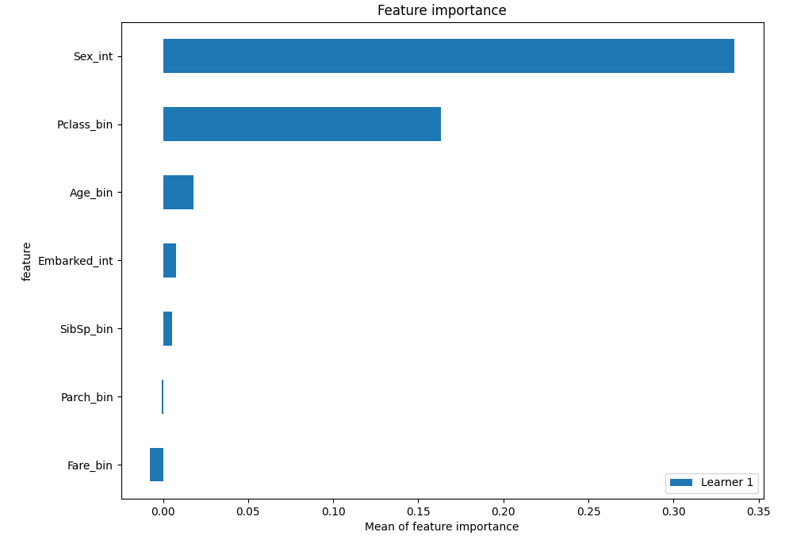
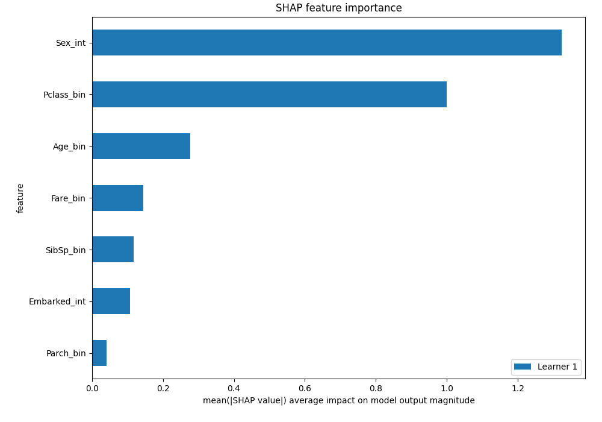
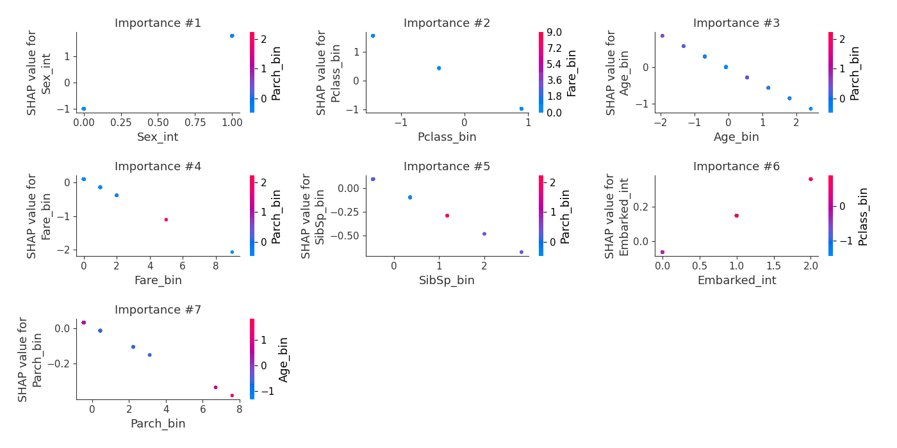

# Summary of 3_Linear

[<< Go back](../README.md)

## Logistic Regression (Linear)
- **n_jobs**: -1
- **explain_level**: 2

## Validation
 - **validation_type**: split
 - **train_ratio**: 0.75
 - **shuffle**: True
 - **stratify**: True

## Optimized metric
logloss

## Training time

10.6 seconds

## Metric details
|           |    score |   threshold |
|:----------|---------:|------------:|
| logloss   | 0.525858 | nan         |
| auc       | 0.806134 | nan         |
| f1        | 0.723404 |   0.659818  |
| accuracy  | 0.80597  |   0.659818  |
| precision | 1        |   0.8504    |
| recall    | 1        |   0.0354073 |
| mcc       | 0.594499 |   0.659818  |

## Confusion matrix (at threshold=0.659818)
|                     |   Predicted as negative |   Predicted as positive |
|:--------------------|------------------------:|------------------------:|
| Labeled as negative |                      74 |                       6 |
| Labeled as positive |                      20 |                      34 |

## Learning curves

## Coefficients
| feature      |   Learner_1 |
|:-------------|------------:|
| Sex_int      |   2.77484   |
| Embarked_int |   0.21057   |
| Parch_bin    |  -0.0508993 |
| SibSp_bin    |  -0.236396  |
| Fare_bin     |  -0.243336  |
| Age_bin      |  -0.458813  |
| Pclass_bin   |  -1.07314   |
| intercept    |  -1.53203   |

## Permutation-based Importance

## SHAP Importance

## SHAP Dependence plots

### Dependence (Fold 1)

## SHAP Decision plots

[<< Go back](../README.md)
