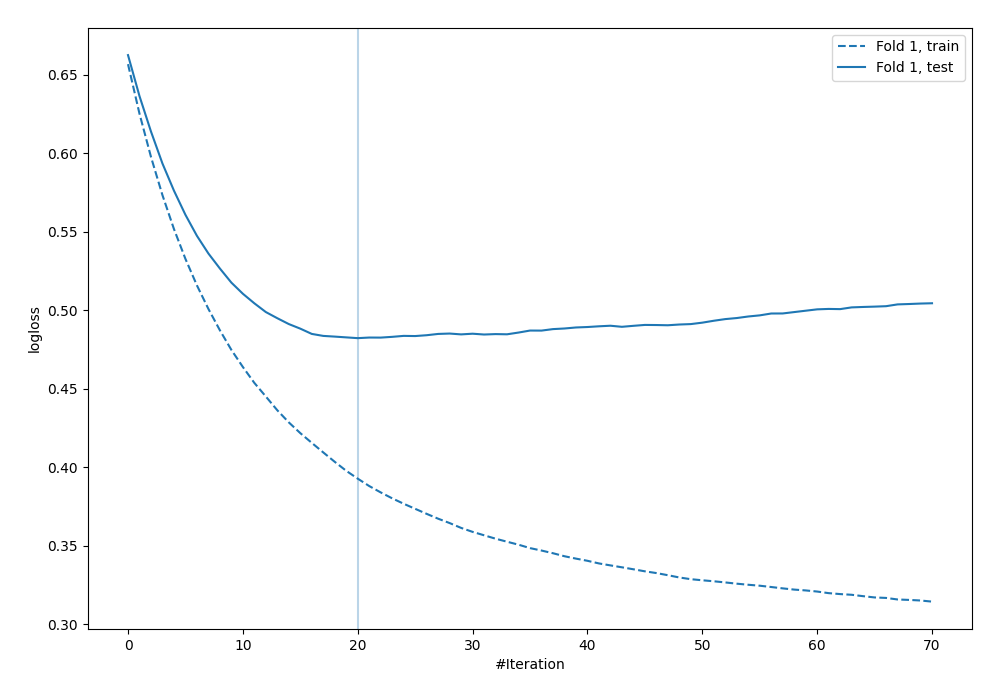
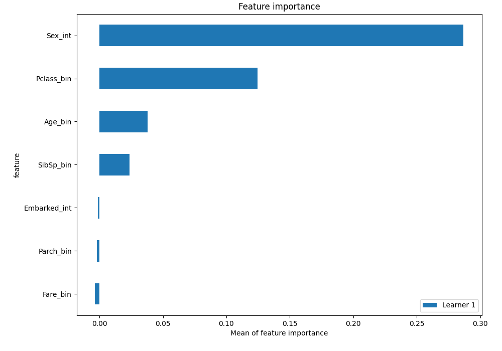
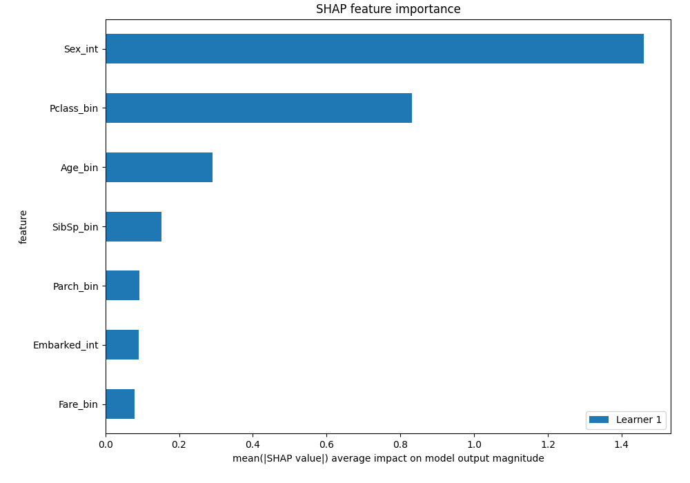
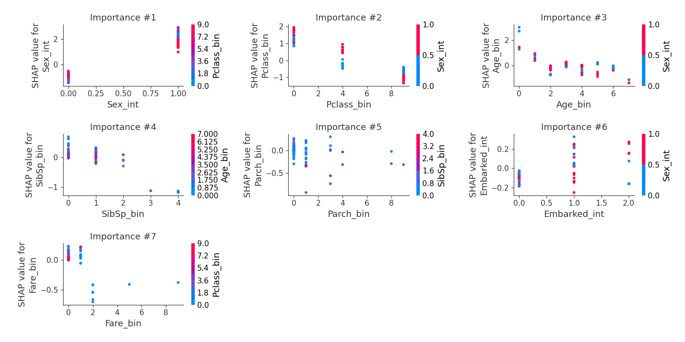

# Summary of 4_Default_Xgboost

[<< Go back](../README.md)

## Extreme Gradient Boosting (Xgboost)
- **n_jobs**: -1
- **objective**: binary:logistic
- **eval_metric**: logloss
- **eta**: 0.075
- **max_depth**: 6
- **min_child_weight**: 1
- **subsample**: 1.0
- **colsample_bytree**: 1.0
- **explain_level**: 2

## Validation
 - **validation_type**: split
 - **train_ratio**: 0.75
 - **shuffle**: True
 - **stratify**: True

## Optimized metric
logloss

## Training time

35.9 seconds

## Metric details
|           |    score |   threshold |
|:----------|---------:|------------:|
| logloss   | 0.482327 |  nan        |
| auc       | 0.821644 |  nan        |
| f1        | 0.755102 |    0.579289 |
| accuracy  | 0.820896 |    0.579289 |
| precision | 1        |    0.856763 |
| recall    | 1        |    0.144387 |
| mcc       | 0.624262 |    0.579289 |

## Confusion matrix (at threshold=0.579289)
|                     |   Predicted as negative |   Predicted as positive |
|:--------------------|------------------------:|------------------------:|
| Labeled as negative |                      73 |                       7 |
| Labeled as positive |                      17 |                      37 |

## Learning curves

## Permutation-based Importance

## SHAP Importance

## SHAP Dependence plots

### Dependence (Fold 1)

## SHAP Decision plots

[<< Go back](../README.md)
