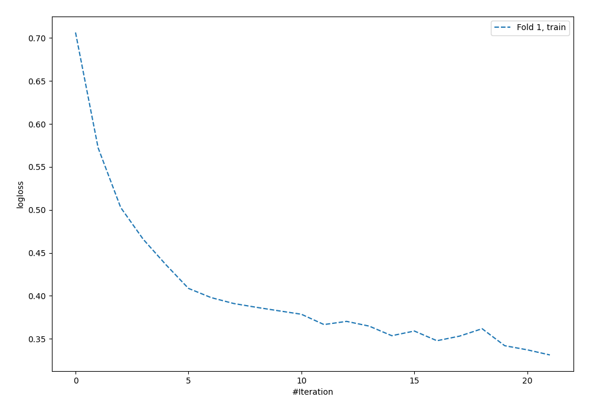
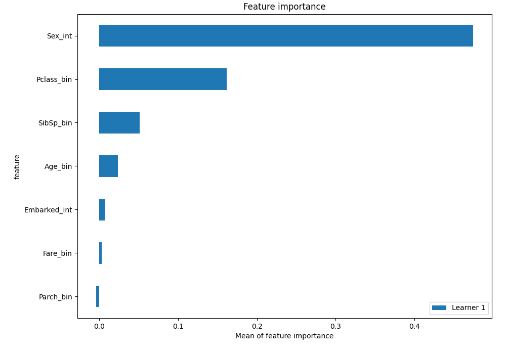

# Summary of 5_Default_NeuralNetwork

[<< Go back](../README.md)

## Neural Network
- **n_jobs**: -1
- **dense_1_size**: 32
- **dense_2_size**: 16
- **learning_rate**: 0.05
- **explain_level**: 2

## Validation
 - **validation_type**: split
 - **train_ratio**: 0.75
 - **shuffle**: True
 - **stratify**: True

## Optimized metric
logloss

## Training time

1.2 seconds

## Metric details
|           |    score |   threshold |
|:----------|---------:|------------:|
| logloss   | 0.508592 | nan         |
| auc       | 0.819097 | nan         |
| f1        | 0.720721 |   0.338063  |
| accuracy  | 0.783582 |   0.798111  |
| precision | 1        |   0.988821  |
| recall    | 1        |   0.0207729 |
| mcc       | 0.565773 |   0.798111  |

## Confusion matrix (at threshold=0.798111)
|                     |   Predicted as negative |   Predicted as positive |
|:--------------------|------------------------:|------------------------:|
| Labeled as negative |                      78 |                       2 |
| Labeled as positive |                      27 |                      27 |

## Learning curves

## Permutation-based Importance

[<< Go back](../README.md)
