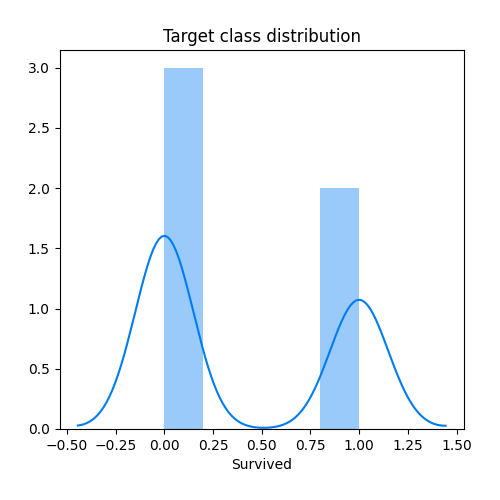
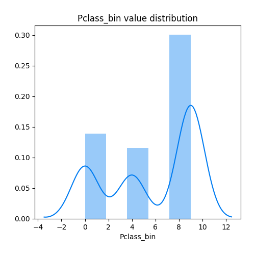
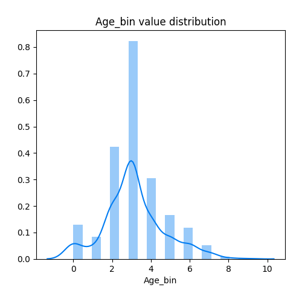
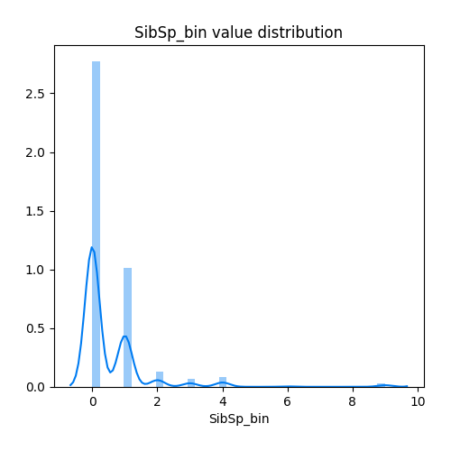
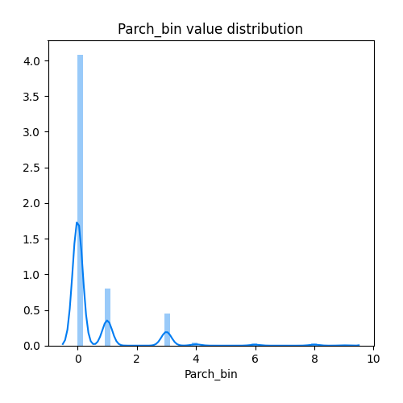
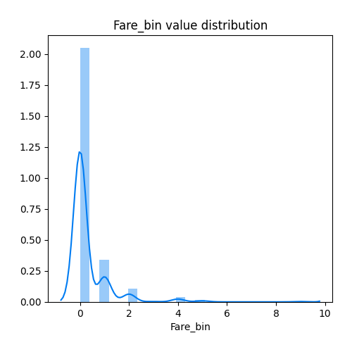
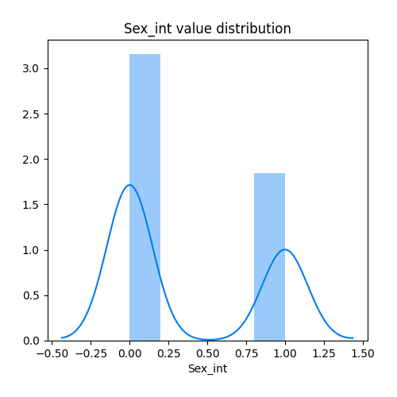
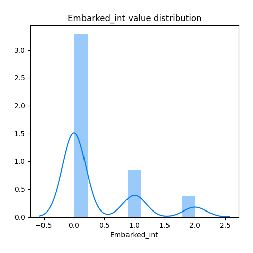

# Exploratory Data Analysis

[<< Go back](../README.md)
## Feature : target
- **Feature type** : continous
- **Missing** : 0.0%
- **Unique** : 2
- **Count** :534.0
- **Mean** :0.40074906367041196
- **Std** :0.49050974820631804
- **Min** :0.0
- **25%th Percentile** : 0.0
- **50%th Percentile** : 0.0
- **75%th Percentile** : 1.0
- **Max** :1.0

## Feature : Pclass_bin
- **Feature type** : discrete
- **Missing** : 0.0%
- **Unique** : 3
- **Count** :534.0
- **Mean** :5.702247191011236
- **Std** :3.830767440188484
- **Min** :0.0
- **25%th Percentile** : 1.0
- **50%th Percentile** : 9.0
- **75%th Percentile** : 9.0
- **Max** :9.0

## Feature : Age_bin
- **Feature type** : discrete
- **Missing** : 0.0%
- **Unique** : 10
- **Count** :534.0
- **Mean** :3.1329588014981273
- **Std** :1.5542472977182884
- **Min** :0.0
- **25%th Percentile** : 2.0
- **50%th Percentile** : 3.0
- **75%th Percentile** : 4.0
- **Max** :9.0

## Feature : SibSp_bin
- **Feature type** : discrete
- **Missing** : 0.0%
- **Unique** : 7
- **Count** :534.0
- **Mean** :0.5224719101123596
- **Std** :1.1222049598914519
- **Min** :0.0
- **25%th Percentile** : 0.0
- **50%th Percentile** : 0.0
- **75%th Percentile** : 1.0
- **Max** :9.0

## Feature : Parch_bin
- **Feature type** : discrete
- **Missing** : 0.0%
- **Unique** : 7
- **Count** :534.0
- **Mean** :0.5205992509363296
- **Std** :1.2060459079807189
- **Min** :0.0
- **25%th Percentile** : 0.0
- **50%th Percentile** : 0.0
- **75%th Percentile** : 0.75
- **Max** :9.0

## Feature : Fare_bin
- **Feature type** : discrete
- **Missing** : 0.0%
- **Unique** : 7
- **Count** :534.0
- **Mean** :0.3258426966292135
- **Std** :0.8611953065781677
- **Min** :0.0
- **25%th Percentile** : 0.0
- **50%th Percentile** : 0.0
- **75%th Percentile** : 0.0
- **Max** :9.0

## Feature : Sex_int
- **Feature type** : discrete
- **Missing** : 0.0%
- **Unique** : 2
- **Count** :534.0
- **Mean** :0.36891385767790263
- **Std** :0.48296296657937876
- **Min** :0.0
- **25%th Percentile** : 0.0
- **50%th Percentile** : 0.0
- **75%th Percentile** : 1.0
- **Max** :1.0

## Feature : Embarked_int
- **Feature type** : discrete
- **Missing** : 0.0%
- **Unique** : 3
- **Count** :534.0
- **Mean** :0.35580524344569286
- **Std** :0.6312633685101141
- **Min** :0.0
- **25%th Percentile** : 0.0
- **50%th Percentile** : 0.0
- **75%th Percentile** : 1.0
- **Max** :2.0

[<< Go back](../README.md)
