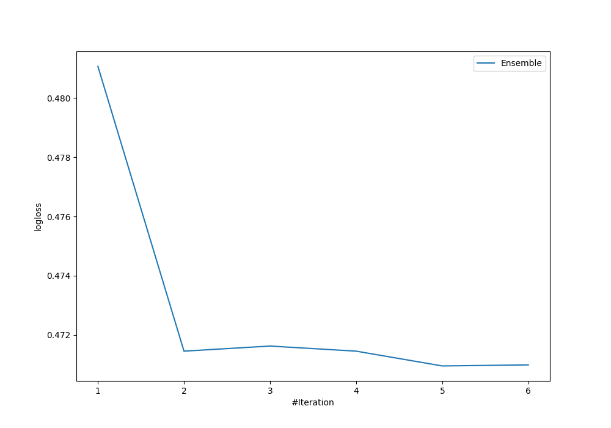

# Summary of Ensemble

[<< Go back](../README.md)

## Ensemble structure
| Model                  |   Weight |
|:-----------------------|---------:|
| 2_DecisionTree         |        1 |
| 4_Default_Xgboost      |        2 |
| 6_Default_RandomForest |        2 |

## Metric details
|           |    score |   threshold |
|:----------|---------:|------------:|
| logloss   | 0.470952 |  nan        |
| auc       | 0.829051 |  nan        |
| f1        | 0.755102 |    0.606676 |
| accuracy  | 0.820896 |    0.606676 |
| precision | 1        |    0.922975 |
| recall    | 1        |    0.102432 |
| mcc       | 0.624262 |    0.606676 |

## Confusion matrix (at threshold=0.606676)
|                     |   Predicted as negative |   Predicted as positive |
|:--------------------|------------------------:|------------------------:|
| Labeled as negative |                      73 |                       7 |
| Labeled as positive |                      17 |                      37 |

## Learning curves

[<< Go back](../README.md)
